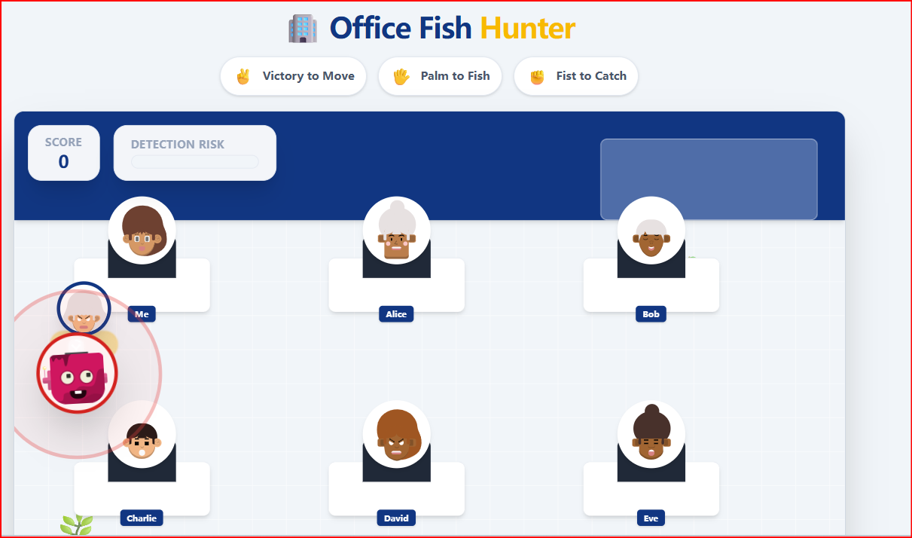

<p align="center">
  
</p>

# 🏢 Office Fish Hunter

一个办公室主题的 **摸鱼模拟 / 钓鱼小游戏** 🐟  
你用 **不同手指** 控制角色走位，用 **摄像头手势** 在工位前摸鱼、抓鱼，躲避老板巡查。

👉 **无需构建、无需安装依赖**  
👉 **纯 HTML + CDN，GitHub Pages 打开就能玩**

**在线试玩：**  
https://bucila-ctrl.github.io/office-slacker_edition/

---

## ✨ Features | 功能特色

### 🧭 手势移动（核心操控 / Core Control）
- **无需键盘**：全程用摄像头识别手势来移动角色
- **离散方向移动（慢速步伐）**：只输出 `-1/0/1` 方向，走位更稳不乱飘
  - **1 指**：向左移动（LEFT）
  - **2 指**：向右移动（RIGHT）
  - **3 指**：向上移动（UP）
  - **4 指**：向下移动（DOWN）
- 未识别到有效手势时，角色保持原地（避免误触漂移）

- **No keyboard needed**: movement is fully controlled by camera hand gestures
- **Discrete direction steps (slow walk)**: outputs only `-1/0/1` directions for stable movement (no drifting)
  - **1 finger**: move LEFT
  - **2 fingers**: move RIGHT
  - **3 fingers**: move UP
  - **4 fingers**: move DOWN
- If no valid gesture is detected, the character stays still to prevent accidental motion

---

### 🖐️ 摸鱼 / 抓鱼（核心玩法 / Core Gameplay）
- **Open Palm（张开手掌）**：开始摸鱼（进度 ↑，风险 ↑）
- **Closed Fist（握拳）**：抓鱼结算奖励（优先级最高）
- **松开拳头**：关闭奖励弹窗，继续行动

- **Open Palm**: start fishing (progress ↑, risk ↑)
- **Closed Fist**: catch & claim rewards (**highest priority**)
- **Release fist**: close reward popup and continue

---

### 🧠 风险与老板系统 | Risk & Boss System
- 摸鱼会累积 **风险值**
- 老板随机巡逻
- 距离过近会被抓 → 扣分

- Fishing increases your **risk level**
- The boss patrols randomly
- Get too close → caught, score penalty

---

### 🧭 不怕迷路 | Navigation Aids
- 移动会留下 **轨迹尾巴**
- 脚下有 **定位光圈**
- 在办公室里走来走去也不会丢角色

- Movement leaves a **trail**
- A **glow circle** marks the player position
- Easy to track your character at all times

---

### 🌐 纯静态部署 | Fully Static Deployment
- React / MediaPipe 全部使用 CDN
- GitHub Pages 打开即玩

- React & MediaPipe via CDN
- Works instantly on GitHub Pages


```bash
python -m http.server 5173
